# Databricks -  description
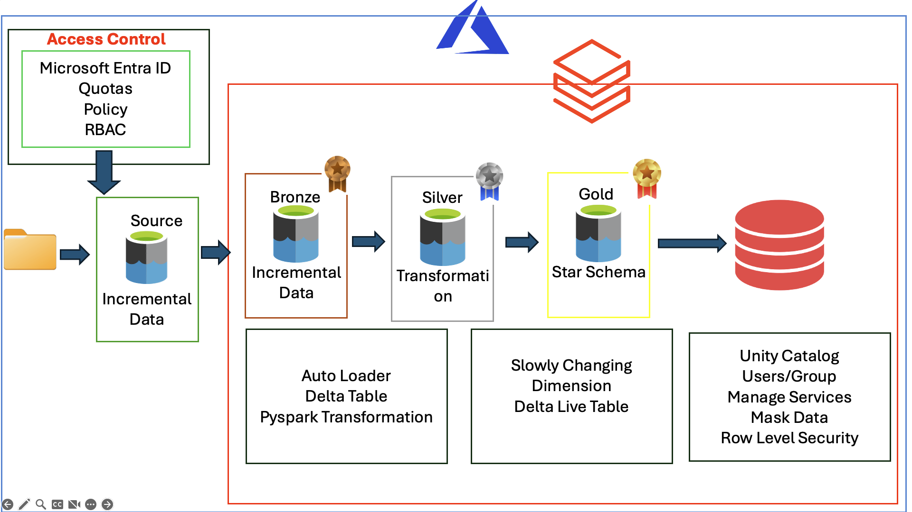
## 🧱 Architecture Layers Explained

This Lakehouse architecture follows a structured **Bronze → Silver → Gold** pipeline using Databricks and Delta Lake. Below is a detailed breakdown of what happens in each layer and why it's important.

---

### 🟫 Bronze Layer — Raw Incremental Data

#### 🔄 What Happens
- Ingests raw **incremental data** from external sources (e.g., cloud storage, file drops).
- Minimal processing; data is preserved as-is to retain lineage and allow replay.

#### 🔧 Implementation
- Uses **Databricks Auto Loader** to detect and load new files.
- Stores data in **Delta Tables** inside the Bronze zone.
- Schema is inferred or predefined; append-only by default.

#### 🧠 Why It Matters
- Serves as the **source of truth** for all downstream processing.
- Ensures that original input is always available for auditing or reprocessing.
- Decouples data producers from consumers.

#### 📘 Related Notebook
- `ingest_bronze.ipynb` handles data ingestion with Auto Loader.

---

### ⬜ Silver Layer — Data Transformation & Enrichment

#### 🔄 What Happens
- Cleans and transforms raw data:
  - Removes duplicates and nulls
  - Applies schema standardization
  - Joins with lookup tables for enrichment (e.g., region names, payment types)

#### 🔧 Implementation
- Uses **PySpark transformations** and SQL logic.
- Stores output in Silver Delta tables.
- Applies **business logic and data validation** rules.

#### 🧠 Why It Matters
- Converts raw data into **reliable datasets**.
- Ensures consistent and high-quality data for analytics.
- Simplifies queries for downstream users.

#### 📘 Related Notebooks
- `silver_transformation.ipynb`: Contains cleaning and transformation logic.
- `source_lookup.ipynb`: Builds reference tables used in Silver joins.

---

### 🟨 Gold Layer — Star Schema for Analytics

#### 🔄 What Happens
- Organizes cleaned data into a **star schema**:
  - One central fact table: `fact_sales`
  - Multiple dimension tables: `dim_customer`, `dim_product`, `dim_date`, etc.

#### 🔧 Implementation
- Built with **Delta Live Tables (DLT)** pipelines.
- Designed for **analytical queries and BI dashboards**.
- Stored under the `goldschema` schema in the `metacatalog` Unity Catalog.

#### 🧠 Why It Matters
- Provides **semantic structure and performance optimization**.
- Empowers analysts with self-service reporting.
- Adheres to standard data modeling practices.

#### 📘 Related Notebooks
- `gold_tables_dlt.ipynb`: DLT pipelines for creating Gold tables.
- `gold_tables_autoloaders.ipynb`: Autoloader support for ingestion-ready gold tables.

---

## 🔒 Security & Governance Layer (Cross-Cutting)
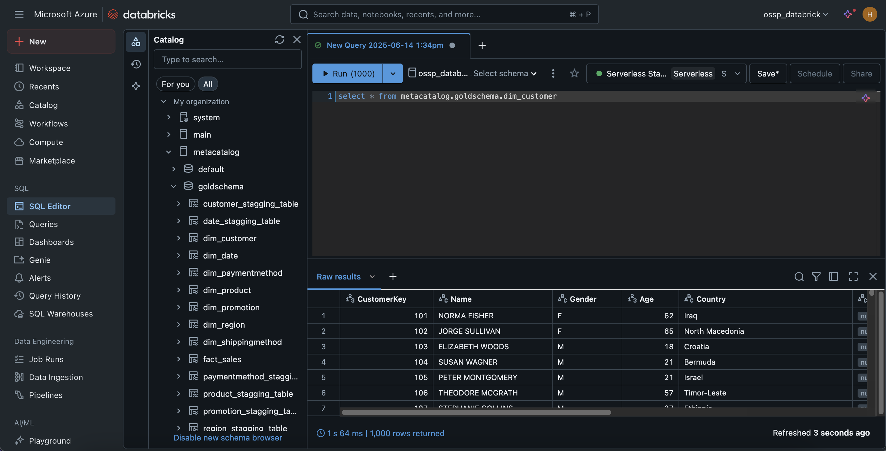

Security is enforced across all layers via:

- **Microsoft Entra ID (Azure AD)**: Manages users and group roles.
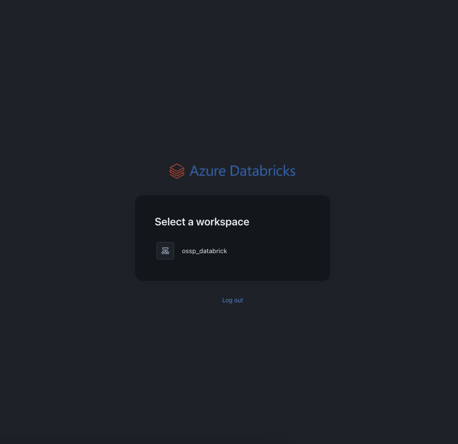
- **Unity Catalog**:
  - Controls access to catalogs, schemas, and tables
  - Applies **column-level masking** on sensitive data (e.g., `Gender`, `Age`)
- **Group-Based Access**:
  - `admins` → full access, including unmasked fields
  - `data_analysis` → read-only with masked data

#### 📘 Related Notebooks
- `SET_MASKING.ipynb`: Applies masking policies to fields.
- `SET_LOW_SECURITY.ipynb`: Demonstrates reduced security config for testing.

# Azure Access Management

## ☁️ Azure Layer – Access Control & Identity Governance

The Azure layer in this architecture acts as the **foundation for secure access management**. It integrates identity, policy enforcement, and RBAC (Role-Based Access Control) to ensure the right users have access to the right data at the right time.

---

### 🔐 Identity Provider: Microsoft Entra ID (formerly Azure Active Directory)

Microsoft Entra ID is used to manage **enterprise identities**, ensuring consistent and secure user authentication across Databricks and all Azure services.

#### Responsibilities:
- User authentication via **Single Sign-On (SSO)**
- Management of user groups (e.g., `admins`, `data_analysis`)
- Centralized control over **who can access what**
- Enforced multi-factor authentication (MFA) and conditional access policies

#### Benefits:
- Seamless login experience across Azure and Databricks
- Simplified access management through group-based policies
- Scalable and secure enterprise governance model

---

### 📦 Policy and Quotas (Azure Governance)
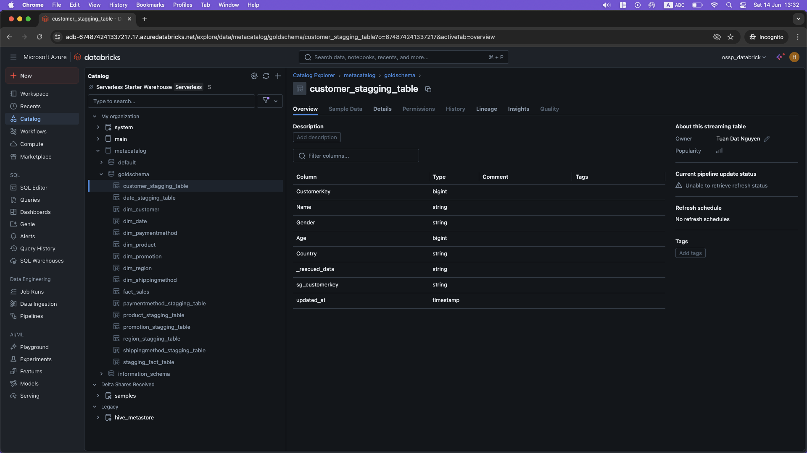

Azure provides organization-wide control mechanisms that enforce limits and governance policies:

- **Quotas**: Control resource usage (e.g., compute, storage) to prevent cost overruns
- **Azure Policies**: Define and enforce rules for resource creation and usage
- **RBAC (Role-Based Access Control)**: Limits what actions users or groups can perform

These policies ensure that only authorized users can:
- Access the Databricks workspace
- Use compute clusters
- Run jobs or pipelines
- Query sensitive datasets

---

### 👥 Group-Based Access Control (RBAC)

Azure RBAC integrates with Microsoft Entra ID groups to define access permissions across services.

| Group         | Assigned Role                        | Scope                                      |
|---------------|--------------------------------------|--------------------------------------------|
| `admins`      | Owner / Contributor                  | Full access to Databricks and data layers  |
| `data_analysis` | Reader / Databricks SQL User         | Limited access, read-only, data masking applied |

These groups are used both in Azure (for workspace access) and in Databricks Unity Catalog (for fine-grained table access and masking logic).

---

### 🧭 Flow of Identity and Policy Enforcement

```text
[ Microsoft Entra ID ]
     │
     ├── User Authentication (SSO)
     ├── Group Assignment (admins, data_analysis)
     └── Conditional Access + MFA
           │
           ▼
[ Azure Resource RBAC ]
     └─ Controls workspace access, compute usage, permissions


# Admin Guide: Azure Databricks Lakehouse Access & Governance

This document provides an in-depth description of how user access, group-based permissions, and data governance are structured and enforced in the Azure Databricks Lakehouse implementation. Rather than only showing how to do tasks, it explains why each governance choice exists.

---
```
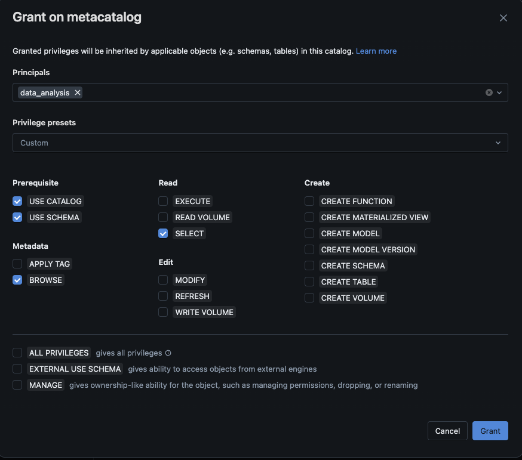

## 🧑‍💼 User and Group Management Overview

Access to the Databricks workspace and data catalog is managed through integration with **Microsoft Entra ID (Azure Active Directory)**. Users are granted access via groups, each with specific responsibilities and permission levels.

### Key Groups

- **`admins`**
  - Full administrative rights across Databricks and Unity Catalog.
  - Can create schemas, manage masking policies, grant/revoke access.
  - Includes platform engineers or data governance officers.

- **`data_analysis`**
  - Analysts and business users.
  - Granted read-only access to gold-layer tables.
  - Subject to masking for sensitive fields.

Group assignment is evaluated dynamically by Unity Catalog during data access.
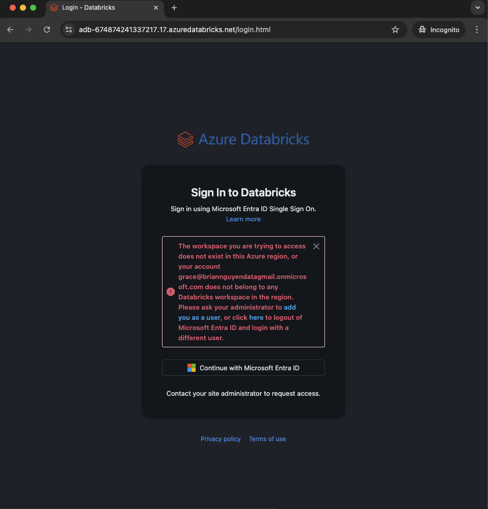


---

## 🔐 Unity Catalog Permission Structure

Unity Catalog enforces access control across all data layers (catalogs, schemas, and tables).

### Typical Permissions per Group

```sql
-- Catalog-level access
GRANT USE CATALOG ON CATALOG metacatalog TO `data_analysis`;

-- Schema-level access
GRANT USE SCHEMA ON SCHEMA metacatalog.goldschema TO `data_analysis`;

-- Table-level access
GRANT SELECT ON ALL TABLES IN SCHEMA metacatalog.goldschema TO `data_analysis`;

-- Optional: Allow UI table browsing
GRANT BROWSE ON SCHEMA metacatalog.goldschema TO `data_analysis`;
```
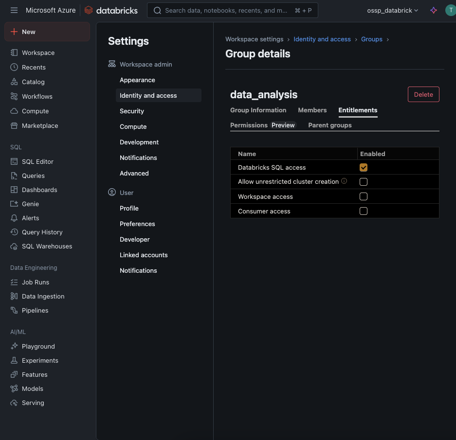

## 🎭 Data Masking Strategy

To protect personal data, Unity Catalog implements **column-level masking** for fields such as:

- `Gender`
- `Age`
- `Country`

### Masking Behavior

- Users in the `admins` group will see the full, unmasked data.
- Users in the `data_analysis` group will see masked values (e.g., `NULL`, `"Restricted"`).
- These rules are defined using `SET MASKING POLICY` in the notebook `SET_MASKING.ipynb`.

This approach ensures compliance with internal data governance standards and regulatory requirements such as GDPR or company-specific policies.
## 🧠 Governance Intent
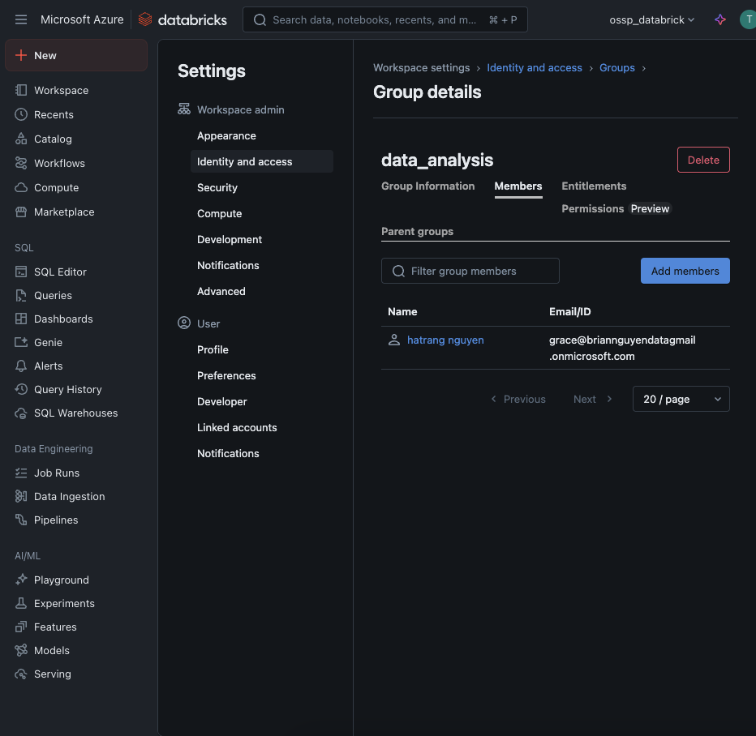

The architecture follows these principles:

- **Least Privilege**: Only essential access is granted.
- **Separation of Duties**: Admins administer; analysts consume.
- **Data Protection**: PII is masked unless needed.
- **Centralized Control**: Unity Catalog manages all workspace data access.

---

## 🐞 Common Access Issues Explained
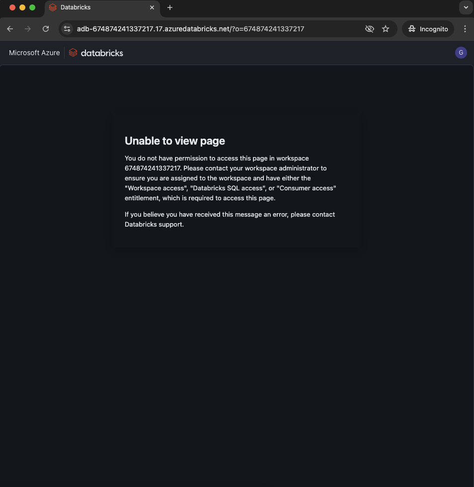
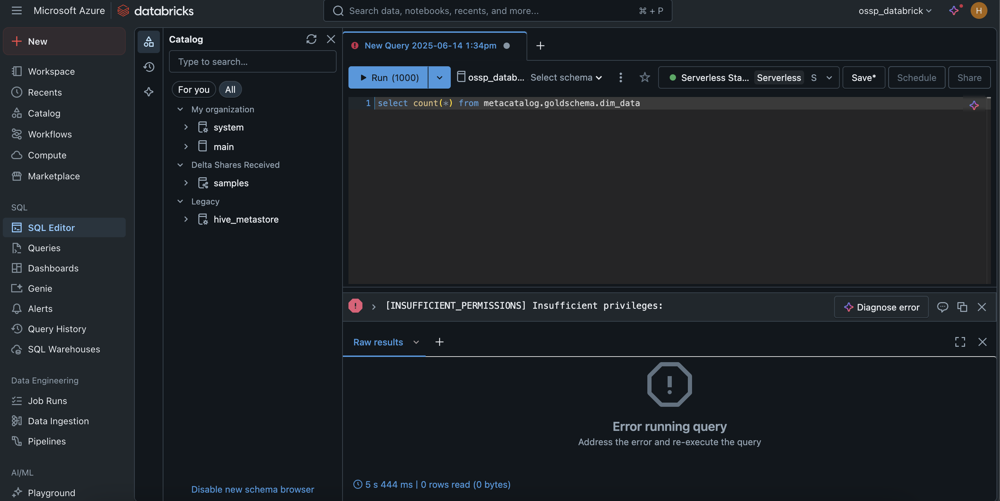
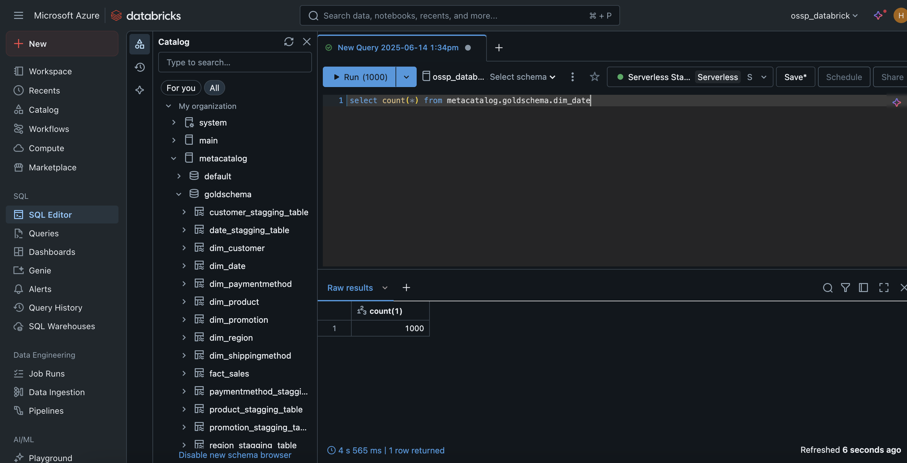

| Scenario                         | Cause                    | Explanation                                                                 |
|----------------------------------|---------------------------|------------------------------------------------------------------------------|
| User can’t view SQL Editor       | Missing entitlement       | Enable “Databricks SQL Access” in user settings.                            |
| Queries return `INSUFFICIENT_PRIVILEGES` | Permissions not granted | Ensure `USE SCHEMA`, `SELECT`, and `BROWSE` are granted in Unity Catalog.   |
| Fields like `Gender` show NULL   | Masking in effect         | The user isn’t in a group with unmasked access.                             |
| User can’t enter workspace       | Not added to workspace    | Add the user to the workspace via Admin Console.                            |
## 📋 Governance Checklist

- [x] User exists in Azure Active Directory
- [x] User added to Databricks workspace
- [x] `Databricks SQL Access` entitlement assigned
- [x] User assigned to correct group (e.g., `data_analysis`)
- [x] Catalog, schema, and table permissions granted
- [x] Masking behavior verified with test queries

